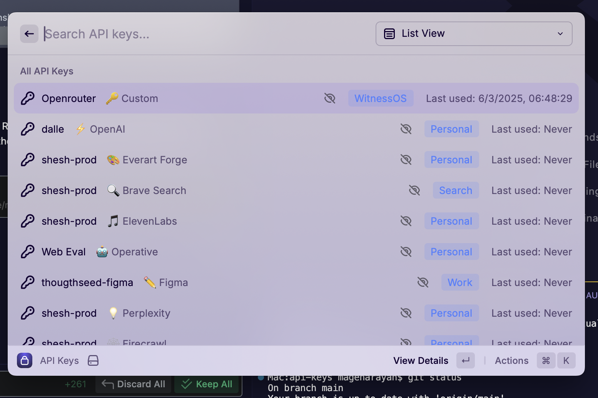

# 🔐 API Keys Manager for Raycast

<div align="center">


**Secure, fast, and intuitive API key management right from your Raycast launcher**

[](https://github.com/raycast/extensions)
[](./package.json)
[](https://www.typescriptlang.org/)
[](https://reactjs.org/)
[](./LICENSE)

[Installation](#-installation) • [Features](#-features) • [Usage](#-usage) • [Security](#-security) • [Contributing](#-contributing)

</div>

---

## 🚀 Overview

API Keys Manager is a powerful Raycast extension that provides secure, local storage and management of your API keys. Built for developers and power users who work with multiple APIs daily, it offers lightning-fast access to your credentials without compromising security.

### ✨ Key Highlights

- 🔒 **100% Local Storage** - Your keys never leave your machine
- ⚡ **Lightning Fast** - Access any API key in seconds
- 🎯 **Smart Organization** - Categorize and search your keys
- 📋 **Secure Clipboard** - Auto-clearing clipboard for enhanced security
- 🎨 **Beautiful Interface** - Clean, intuitive design that feels native
- ⌨️ **Keyboard First** - Full keyboard navigation and shortcuts

---

## 📸 Screenshots

### Main Interface - List View

*Clean, organized list view showing your API keys with service icons, categories, and last used timestamps*

### Detailed Key View

*Comprehensive key details with secure viewing options, edit capabilities, and full key information*

### Adding New API Keys

*Simple, intuitive form for adding new API keys with service categorization and notes*

---

## ✨ What Makes This Extension Special

### 🎯 **Smart Organization**
As shown in the screenshots above, the extension provides:
- **Service Icons**: Visual identification for popular services like OpenAI, GitHub, Stripe
- **Category Tags**: Organize keys by project, environment, or custom categories
- **Last Used Tracking**: See when you last accessed each key for better management

### 🔒 **Security First**
- **Masked by Default**: Keys are hidden with dots (••••••••) until you choose to reveal them
- **Local Storage Only**: All data stays on your machine in `~/.raycast-api-keys/`
- **Auto-Clear Clipboard**: Copied keys are automatically removed from clipboard after 30 seconds

### ⚡ **Lightning Fast Access**
- **Instant Search**: Type to filter through hundreds of keys in milliseconds
- **Keyboard Shortcuts**: Full keyboard navigation for power users
- **Quick Copy**: One keystroke to securely copy any API key

---

## 🎯 Features

### Core Functionality
- ✅ **Secure Local Storage** - Encrypted storage in your home directory
- ✅ **Quick Access** - Find any key in milliseconds with search
- ✅ **Smart Categorization** - Organize keys by service, project, or custom tags
- ✅ **Clipboard Management** - Auto-clearing clipboard (30s default)
- ✅ **Multiple View Modes** - List and grid views for different workflows
- ✅ **Last Used Tracking** - See when you last accessed each key

### Security Features
- 🔐 **Local-Only Storage** - No cloud, no external services
- 👁️ **Masked Display** - Keys hidden by default, reveal on demand
- 🕐 **Auto-Clear Clipboard** - Automatic clipboard clearing for security
- 🔄 **No Logging** - Zero logging of sensitive key values

### User Experience
- ⚡ **Instant Search** - Real-time filtering across all keys
- 🎨 **Service Icons** - Visual identification for popular services
- ⌨️ **Keyboard Shortcuts** - Full keyboard navigation
- 📱 **Responsive Design** - Works beautifully in any Raycast window size

---

## 📦 Installation

### From Raycast Store (Recommended)
1. Open Raycast
2. Search for "API Keys Manager"
3. Click "Install Extension"
4. Start managing your keys! 🎉

### Manual Installation
```bash
# Clone the repository
git clone https://github.com/your-username/api-keys-raycast.git

# Navigate to the extension directory
cd api-keys-raycast

# Install dependencies
npm install

# Build the extension
npm run build

# Import into Raycast
# Open Raycast → Extensions → Add Extension → Select the built extension
```

---

## 🎮 Usage

### Quick Start
1. **Launch**: Type `api` in Raycast to open the extension
2. **Add Key**: Press `⌘N` to add your first API key
3. **Copy Key**: Select any key and press `⌘C` to copy securely
4. **Search**: Start typing to filter keys instantly

### Adding API Keys

1. Press `⌘N` or select "Add API Key"
2. Fill in the details:
   - **Name**: Descriptive name for the key (e.g., "OpenAI Production")
   - **Service**: The service/platform (e.g., "OpenAI", "GitHub", "Stripe")
   - **API Key**: Your actual API key
   - **Categories**: Optional tags for organization (e.g., "AI", "Payment", "Development")
   - **Notes**: Additional context or usage notes


### Managing Keys
- **View Details**: Press `Enter` or `⌘D` to see full key details
- **Edit Key**: Press `⌘E` to modify key information
- **Delete Key**: Press `⌘⌫` to remove a key (with confirmation)
- **Toggle Visibility**: Press `⌘H` to show/hide key values

---

## ⌨️ Keyboard Shortcuts

| Shortcut | Action |
|----------|--------|
| `⌘N` | Add new API key |
| `⌘C` | Copy selected key to clipboard |
| `⌘H` | Toggle key visibility |
| `⌘E` | Edit selected key |
| `⌘D` | View key details |
| `⌘⌫` | Delete selected key |
| `⌘[` | Go back to list |
| `↑/↓` | Navigate between keys |
| `Enter` | Open key details |

---

## 🔒 Security

### Local Storage
All API keys are stored locally in `~/.raycast-api-keys/api-keys.json`. This file contains your encrypted keys and never leaves your machine.

### Clipboard Security
- Keys are automatically cleared from clipboard after 30 seconds
- Visual confirmation when clipboard is cleared
- Option to cancel auto-clear if needed

### Best Practices
- ✅ Regular backups of your keys file
- ✅ Use descriptive names without sensitive info
- ✅ Regularly audit and remove unused keys
- ✅ Keep the extension updated

<details>
<summary>🛡️ Advanced Security Considerations</summary>

- The extension uses Node.js built-in encryption for key storage
- No network requests are made by the extension
- Keys are only decrypted when displayed or copied
- Consider using a dedicated backup solution for your keys file

</details>

---

## 🛠️ Development

### Prerequisites
- Node.js 16+ 
- npm or yarn
- Raycast (for testing)

### Setup
```bash
# Install dependencies
npm install

# Start development mode
npm run dev

# Build for production
npm run build

# Run type checking
npm run typecheck
```

### Project Structure
```
src/
├── components/          # Reusable UI components
│   ├── ApiKeyListItem.tsx
│   └── KeyDisplay.tsx
├── utils/              # Utility functions
│   ├── apiKeyStorage.ts
│   └── clipboard.ts
├── index.tsx           # Main extension entry
├── add-api-key.tsx     # Add key form
├── edit-api-key.tsx    # Edit key form
└── view-api-key-detail.tsx # Key detail view
```

### Recent Updates
- 🐛 **Fixed Critical UX Bug**: Copying now returns actual API keys instead of masked dots
- ⚡ **Performance**: Improved search and filtering performance
- 🎨 **UI Polish**: Enhanced visual feedback and animations

---

## 🤝 Contributing

We welcome contributions! Please see our [Contributing Guidelines](./CONTRIBUTING.md) for details.

### Quick Contribution Guide
1. Fork the repository
2. Create a feature branch (`git checkout -b feature/amazing-feature`)
3. Commit your changes (`git commit -m 'Add amazing feature'`)
4. Push to the branch (`git push origin feature/amazing-feature`)
5. Open a Pull Request

---

## 📄 License

This project is licensed under the MIT License - see the [LICENSE](./LICENSE) file for details.

---

## 🙏 Acknowledgments

- Built with ❤️ using [Raycast API](https://developers.raycast.com/)
- Icons from [Raycast Icons](https://www.raycast.com/icons)
- Inspired by the amazing Raycast community

---

<div align="center">

**Made with ❤️ for the developer community**

[Report Bug](https://github.com/your-username/api-keys-raycast/issues) • [Request Feature](https://github.com/your-username/api-keys-raycast/issues) • [Documentation](https://github.com/your-username/api-keys-raycast/wiki)

</div>
